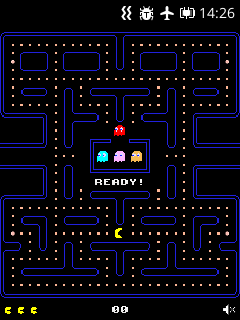
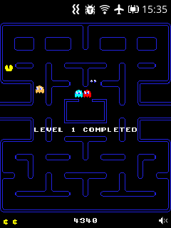
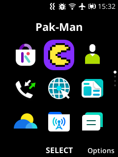
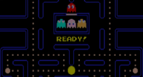

# Pak-Man KaiOS

Pac-Man game built for [KaiOS](https://www.kaiostech.com/) smart feature phones, forked from [Pacman PWA](https://github.com/vitaliy-bobrov/pacman-pwa).

🎮 [Play PWA](https://vitaliy-bobrov.github.io/pacman-pwa/)

Pak-Man is integrated with KaiAds (per [KaiStore Distribution Agreement](https://www.kaiostech.com/sub-agreement/)) and optimized for 240x320 screens.

Ready!  | Level 1 Completed | Homescreen
------ | ------|----------
 |  |  

### Icons 


### Banner



## Install & run:

Built files are stored in a `dist` folder. To run the game, a static server is needed.

- With NodeJS:
  - Using yarn:

  ```bash
  yarn && npm start
  ```

  - Using npm:

  ```bash
  npm install && npm start
  ```

Webpack will run webpack-dev-server on `localhost:3000` with BrowserSync on `localhost:4000`.

- With Python, just run command inside `dist` folder:

```bash
python -m SimpleHTTPServer
```

- With any static server, it should serve files from `dist`

## Controls

### Keyboard

- ENTER - Pause game, start next level, or restart game after win or game over
- UP - Move up
- LEFT - Move left
- DOWN - Move down
- RIGHT - Move right
- SOFTRIGHT - Mute/ Unmute

## Technologies

- Phaser game engine
- TypeScript
- Webpack

## Features:

- Support desktop & mobile devices
- Works offline as a privileged app
- Support keyboard
- 3 levels
- 8-bit music & sounds
- Made with Love :)
